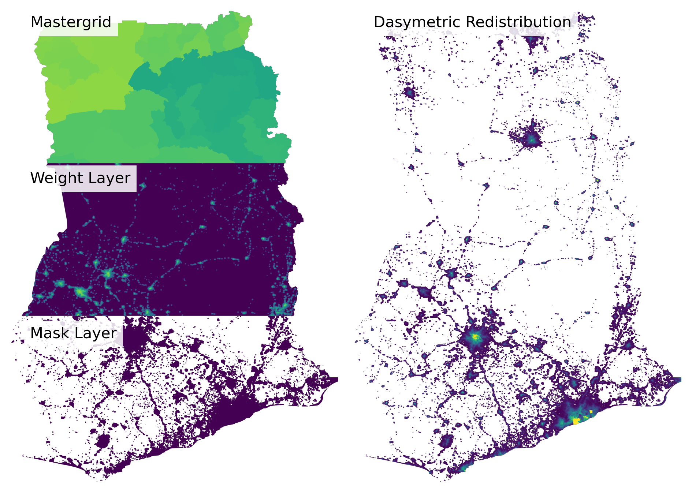

[](https://doi.org/10.5281/zenodo.21815904)

# pyDasymetric


To perform dasymetric redistribution of population.

Given:
  * A raster of relative "weights" (probability / suitability / density proxy     for human presence — e.g. built-up area fraction, night-lights, land cover likelihood surface).
  * A population layer containing total population count per administrative unit.
  * A geometry layer describing the administrative unit boundary. This can be in the form of shapefile or raster defining "id" for each administrative unit. In either input the "id" should be synchronised with the one in the population layer.

This produces a raster where each pixel holds an estimate of population, computed as:

    pop(pixel) = pop(zone) * weight(pixel) / sum(weight(pixels in zone))

If the raster has more blocks/windows than `max_blocks`, the algorithm runs in two windowed passes over the raster. In this way files that are larger than RAM can be processed:

  * Pass 1 (parallel): for every raster block, rasterise the admin polygons that intersect it and accumulate a partial sum of weights per zone. Partial sums are combined in the main process into exact global sums.

  * Pass 2 (parallel): for every raster block, rasterise again, look up each zone's global weight sum and population, and redistribute population into a per-pixel output array. Results are streamed back to the main process, which is the only process writing to the output GeoTIFF.

Usage
-----
    from dasymetric import DasymetricConfig, DasymetricRedistributor

    config = DasymetricConfig(
        weight_raster_path="covariates/viirs_2024.tif",
        pop_path="data/pop_count.csv",
        geom_path="data/adm_boundary.shp",
        mask_path="masks/settlement_mask.tif",
        pop_field="POP_FIELD",
        id_field="ID_FIELD",
        output_raster_path="out/urban_pop_disaggregated.tif",
        nibble=False,
        n_workers=8,
        max_blocks=128
        block_size=512,
        nodata=-99,
        output_dtype='float64'
    )

    DasymetricRedistributor(config).run()

Or from the command line:

    python dasymetric.py \\
    path/to/weight_raster.tif \\
    path/to/mastergrid.tif \\
    path/to/pop_count.csv \\
    ID_FIELD \\
    POP_FIELD \\
    path/to/output_population.tif \\
    --workers 4 \\
    --block-size 512


## Contributing

Contributions are welcome! Please feel free to submit a Pull Request. For major changes, please open an issue first to discuss what you would like to change.

## License

This project is licensed under the MIT License - see the [LICENSE](LICENSE) file for details.

## Citation

If you use pyDasymetric in your research, please cite:

```bibtex
@software{pyDasymetric,
	title        = {pyDasymetric: Python package to perform dasymetric redistribution of populations.},
	author       = {Priyatikanto R., Bondarenko M., Nosatiuk B..},
	year         = 2026,
	month        = 6,
	publisher    = {GitHub},
    doi          = {10.5281/zenodo.21815905},
	url          = {https://github.com/wpgp/pyDasymetric},
	version      = {0.0.1}
}
```

## Acknowledgments

- Developed by WorldPop SDI [sdi.worldpop.org](https://sdi.worldpop.org)
